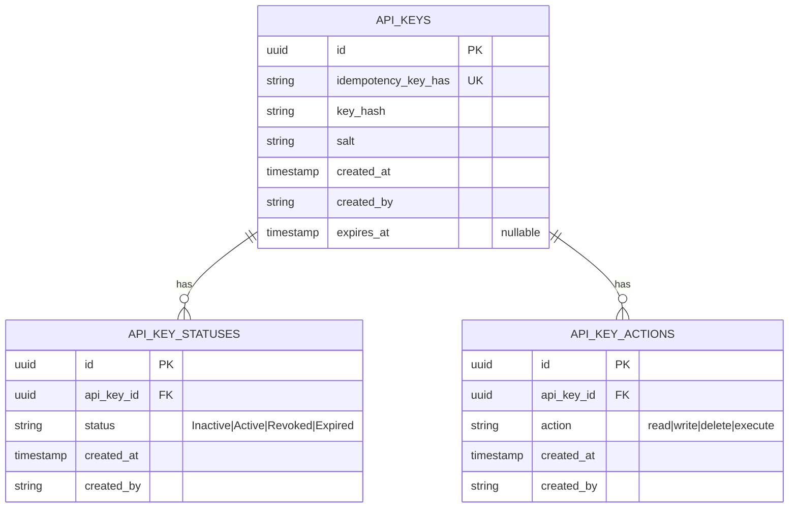

^# Database Schema

Locksmith's database is designed around four core principles: **hash at rest** (never store raw keys), **append-only audit trail** (state transitions are immutable records), **least privilege defaults** (keys and permissions default to inactive/empty), and **forensic evidence** (soft deletes preserve the moment a key was retired).

## Schema overview

The database has three main tables and a collection of supporting tables for configuration and audit. Each table is designed to support a specific concern: key identity and metadata, state history, permission grants, and operational details.



---

## Tables

### api_keys

The identity and metadata table for API keys. A key record is created once at issuing time and never modified or deleted — it is the immutable anchor for all state and permission history.

| Column | Type | Constraints | Purpose |
|---|---|---|---|
| `id` | UUID | Primary Key | Unique identifier for the key |
| `idempotency_key_hash` | string | Unique, Not Null | Prevents duplicate key creation on retry; extracted from `Idempotency-Key` header |
| `key_hash` | VARCHAR(256) | Not Null | PBKDF2 or Argon2 hash of the raw secret + salt. Used for validation; the raw secret is never persisted. |
| `salt` | VARCHAR(64) | Not Null | Random salt used in the hash function; enables per-key salting for resistance against rainbow tables |
| `created_at` | TIMESTAMP | Not Null, Default: NOW | Moment the key was issued |
| `created_by` | VARCHAR(255) | Not Null | Identity of the caller who issued the key (via the Authorization header); enables per-caller audit |
| `expires_at` | TIMESTAMP | Nullable | Optional expiration moment; null means no automatic expiry |

**Immutability:** No `updated_at` or `deleted_at` columns. State transitions go to `api_key_statuses`; permission changes go to `api_key_actions`. The key record itself is final.

**Why this design:**
- Storing only the hash ensures that if the database is compromised, an attacker cannot use captured rows to forge authentication tokens.
- Per-key salting prevents precomputed hash tables (rainbow tables) from being effective across multiple keys.
- Immutability creates an audit anchor: if `api_key_statuses` or `api_key_actions` are modified or deleted maliciously, the `created_by` and `created_at` on this table are tamper-evident because they cannot be changed.

---

### api_key_statuses

An append-only history of state transitions. Every time a key moves to a new state (Inactive → Active, Active → Revoked, etc.), a new row is inserted. The table is never updated or deleted; it only grows.

| Column | Type | Constraints | Purpose |
|---|---|---|---|
| `id` | UUID | Primary Key | Unique identifier for this status record |
| `api_key_id` | UUID | Foreign Key → api_keys.id, Not Null | Links this status to a key |
| `status` | VARCHAR(32) | Not Null, Enum: 'Inactive'\|'Active'\|'Revoked'\|'Expired' | The state the key entered at this moment |
| `created_at` | TIMESTAMP | Not Null, Default: NOW | Moment the transition occurred; defines the timeline |
| `created_by` | VARCHAR(255) | Not Null | Identity of the caller who triggered the state change |

**Immutability enforced at two levels:**
1. **Application layer:** Entity Framework context configuration prevents `Update` and `Delete` operations on this table.
2. **Database layer (recommended):** Revoke `UPDATE` and `DELETE` privileges for the application user on this table. The application role can only `INSERT`.


**State machine:**
```
Inactive ──(activate)──> Active
            │                │
            │                ├──(deactivate)──> Inactive
            │                │
            │                └──(revoke)──────> Revoked
            │
            └──(revoke)──────────────────────> Revoked

Any state ──(expire via Agent job)──> Expired
```

Only valid transitions are allowed. Attempting an invalid transition (e.g., Revoked → Active) throws `ConflictException` before any database write.

---

### api_key_actions

A junction table linking keys to their granted permissions. Each row represents a single grant of a single action. To add a permission, insert a row; to revoke it, delete a row.

| Column | Type | Constraints | Purpose |
|---|---|---|---|
| `id` | UUID | Primary Key | Unique identifier for this grant |
| `api_key_id` | UUID | Foreign Key → api_keys.id, Not Null | Links this grant to a key |
| `action` | VARCHAR(32) | Not Null, Enum: 'read'\|'write'\|'delete'\|'execute' | The action being granted |
| `created_at` | TIMESTAMP | Not Null, Default: NOW | Moment the permission was granted |
| `created_by` | VARCHAR(255) | Not Null | Identity of the caller who granted this permission |
| `(api_key_id, action)` | Composite | Unique constraint | Prevents duplicate grants of the same action to the same key |

---

## Design decisions

### Why no `updated_at` or soft deletes on api_keys?

A key's identity and secret hash never change. State and permissions are tracked separately in append-only tables. This simplification:
- Eliminates temporal ambiguity (which version of the key am I looking at?).
- Forces all state changes through the append-only `api_key_statuses` table, guaranteeing an audit trail.
- Prevents accidental updates that could corrupt the hash or salt.

### Why append-only for status history?

State transitions are forensic events. A complete timeline of who changed what and when is essential for:
- **Audit compliance:** Prove that a key was revoked at a specific moment.
- **Forensic investigation:** Trace the exact sequence of state changes if a key's security is questioned.
- **Preventing tampering:** Append-only constraints at both application and database levels make it very hard to retroactively alter history.

If a key's state is ever modified directly (e.g., `UPDATE api_key_statuses SET status = 'Active' WHERE id = X`), the application will have no record of the change, and audit logs become unreliable.

### Why hash at rest?

Raw API keys are secrets equivalent to passwords. Storing them in plaintext means:
- Any database leak exposes all active keys for all callers immediately.
- No recovery possible; revocation and reissue are the only option.
- Compliance frameworks (PCI-DSS, HIPAA, SOC 2) explicitly forbid plaintext secrets.

Hashing ensures:
- Even a database compromise does not compromise key material.
- The only way to validate a key is to re-hash the presented value and compare (constant-time comparison prevents timing attacks).
- Raw keys are returned exactly once at creation time; after that, only the hash is persisted.

### Why per-key salt?

A single global salt applied to all keys creates a vulnerability: an attacker can precompute hashes for common passphrases and compare against all keys at once (a rainbow table attack). Per-key salts force the attacker to compute a separate table for every key, making the attack infeasible.

### Why idempotency_key as a business key?

`CreateApiKeyCommand` must be idempotent. If a client loses the response, they should be able to retry with the same `Idempotency-Key` header and receive the same raw key. This requires:
- Extracting the idempotency key from the request.
- Storing it in a unique column on `api_keys` so that a second insert with the same key fails at the database constraint level.
- Caching the response (encrypted) in `api_key_idempotency_cache` and returning it on retry.

This prevents silent failures where a key is created but the response is lost, leaving the caller without a usable secret.

---

## Constraints and integrity

### Unique constraints

- `api_keys.idempotency_key_hash` — one key per unique idempotency value (prevents duplicate creates)
- `api_key_actions(api_key_id, action)` — a key cannot be granted the same action twice

### Foreign keys

- `api_key_statuses.api_key_id` → `api_keys.id`
- `api_key_actions.api_key_id` → `api_keys.id`

Both should cascade on delete (if a key is hard-deleted, its status and action history are removed). However, given the append-only design, keys should never be hard-deleted in production.

### Database role privileges (recommended)

```sql
-- Application user can read and insert, but not modify history
REVOKE UPDATE, DELETE ON api_key_statuses FROM app_user;
GRANT SELECT, INSERT ON api_key_statuses TO app_user;

-- Allow normal CRUD on api_keys and api_key_actions for now;
-- if immutability becomes a compliance requirement, revoke UPDATE on api_keys too
REVOKE UPDATE, DELETE ON api_keys TO app_user;
GRANT SELECT, INSERT, ON api_keys TO app_user;

REVOKE UPDATE, DELETE ON api_key_actions TO app_user;
GRANT SELECT, INSERT ON api_key_actions TO app_user;
```

---

```sql
SELECT id FROM api_keys
WHERE expires_at IS NOT NULL
  AND expires_at <= NOW()
  AND id NOT IN (
    SELECT DISTINCT api_key_id FROM api_key_statuses
    WHERE status IN ('Revoked', 'Expired')
  )
ORDER BY expires_at ASC;
```

---

## Data validation at application boundaries

The database schema enforces **structural integrity** (unique constraints, foreign keys) but **not business logic**. The application layer is responsible for:

- **State machine validation:** Only allow transitions defined in the state machine (e.g., Revoked → Active is forbidden).
- **Permission validation:** Reject attempts to grant an action the key already has.
- **Constant-time key comparison:** Use `CryptographicOperations.FixedTimeEquals` when validating a presented key against the stored hash.
- **Encryption at rest:** Raw keys are encrypted with AES-GCM before being returned to the caller; the encrypted ciphertext and nonce are never persisted.

---

## Performance considerations

### Indexes

Create the following indexes to support common query patterns:

```sql
-- Find the current status of a key
CREATE INDEX idx_api_key_statuses_api_key_id_created_at
ON api_key_statuses(api_key_id, created_at DESC);

-- Find all actions for a key
CREATE INDEX idx_api_key_actions_api_key_id
ON api_key_actions(api_key_id);
```

### Append-only table growth

Over time, the tables will grow as keys transition through states (create → activate → revoke, or rotate → rotate → ...). 
- **Archive strategy** for keys older than a retention window (e.g., hard-delete revoked keys after 2 years, or move to a separate archive table).

The append-only design is non-negotiable for audit compliance, but archival can keep the active table lean.
