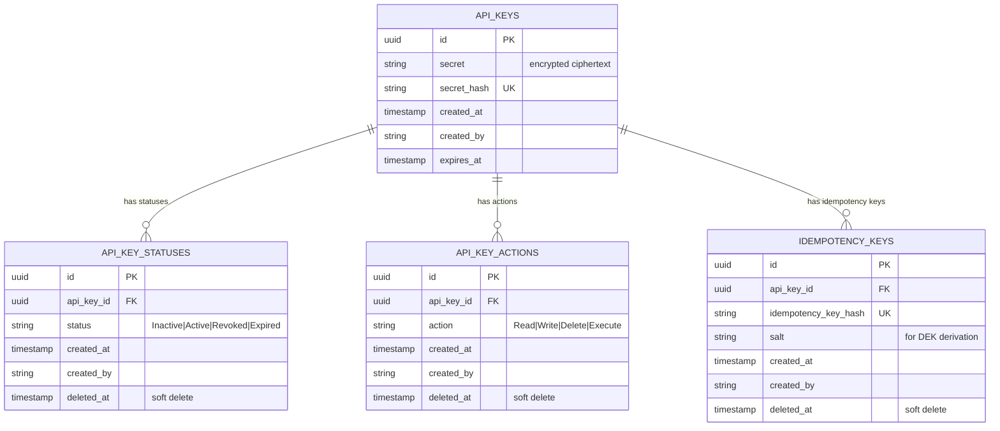

# Database Schema

Locksmith's database stores API keys securely across four tables designed around four core principles: **hash at rest** (never store raw secrets in plaintext), **append-only audit trail** (state transitions are immutable records), **least privilege defaults** (keys start inactive with no permissions), and **forensic evidence** (soft deletes preserve the moment permissions were revoked).

## Schema overview

Four entities model the domain. Each enforces immutability constraints at the application layer to prevent accidental mutations.



---

## Tables

### `api_keys`

The identity and metadata table for API keys. A key record is created once at issuing time and never updated — it is the immutable anchor for all state and permission history.

| Column | Type | Constraints | Purpose |
|---|---|---|---|
| `id` | UUID | Primary Key | Unique identifier for the key |
| `secret` | VARCHAR (max) | Not Null | Encrypted ciphertext of the raw API key secret; encrypted with AES-256-GCM using a derived encryption key (DEK) |
| `secret_hash` | VARCHAR(256) | Unique, Not Null | SHA-256 hash of the raw secret used for O(1) lookups; stored for validation without exposing the plaintext |
| `created_at` | TIMESTAMP | Not Null, Default: NOW | Moment the key was issued |
| `created_by` | VARCHAR(255) | Not Null | Identity of the caller who issued the key (from the `Authorization` header); enables per-caller audit |
| `expires_at` | TIMESTAMP | Not Null | Moment the key expires and becomes invalid |

**Immutability enforced:** `ApiKey` implements `IAppendOnlyTable` like the other three tables (see [Constraints and integrity](#constraints-and-integrity)), but unlike them it has no `deleted_at` column at all — there is no soft-delete path for this table, only insert. `DELETE /api-key` (see [api-surface.md](api-surface.md#delete-a-key)) never touches this row; it soft-deletes the related `api_key_statuses`, `api_key_actions`, and `idempotency_keys` rows instead, leaving the key record as a permanent, unreachable anchor. State transitions are tracked in the separate `api_key_statuses` table; permission changes go to `api_key_actions`.

**Why this design:**
- Storing only the hash ensures that if the database is compromised, an attacker cannot use raw keys to forge authentication tokens.
- The encrypted secret is stored but useless without decryption — requires the salt and Argon2id-derived key from the idempotency record.
- No mutable state on the key itself creates an immutable audit anchor.

---

### `idempotency_keys`

Links each API key to the idempotency key provided at creation time. Stores the salt needed to re-derive the encryption key (DEK) for decrypting the raw secret. This table is separate to allow idempotent retrieval: present the original idempotency key, hash it, look up the salt, and decrypt the secret.

| Column | Type | Constraints | Purpose |
|---|---|---|---|
| `id` | UUID | Primary Key | Unique identifier for this idempotency record |
| `api_key_id` | UUID | Foreign Key → api_keys.id, Not Null | Links to the key |
| `idempotency_key_hash` | VARCHAR(256) | Unique, Not Null | SHA-256 hash of the client-provided `Idempotency-Key` header; enables O(1) lookup on retry |
| `salt` | VARCHAR(256) | Not Null | Random salt used to derive the Data Encryption Key (DEK) via Argon2id; unique per key |
| `created_at` | TIMESTAMP | Not Null, Default: NOW | Moment the idempotency record was created (same as the key) |
| `created_by` | VARCHAR(255) | Not Null | Identity of the caller who created the key |
| `deleted_at` | TIMESTAMP | Nullable | Soft-delete timestamp; set when the key is deleted (`DELETE /api-key`), which stops the idempotency key from resolving to the key at all |

**Immutability enforced:** Implements `IAppendOnlyTable`. Cannot be updated; can only be inserted or soft-deleted via `DeletedAt`.

**Why separate table:**
- Decryption requires the salt. If salt lived on the key, every key lookup would expose it even when not needed.
- Separating idempotency concerns from key metadata clarifies the domain model.
- Allows `CreateApiKey` to be idempotent: same `Idempotency-Key` → same salt → same DEK → same decrypted secret returned.

---

### `api_key_statuses`

An append-only history of state transitions. Every time a key moves to a new state (Inactive → Active, Active → Revoked, etc.), a new row is inserted. The table is never updated; it only grows.

| Column | Type | Constraints | Purpose |
|---|---|---|---|
| `id` | UUID | Primary Key | Unique identifier for this status record |
| `api_key_id` | UUID | Foreign Key → api_keys.id, Not Null | Links this status to a key |
| `status` | VARCHAR(32) | Not Null, Enum: `Inactive` \| `Active` \| `Revoked` \| `Expired` | The state the key entered at this moment |
| `created_at` | TIMESTAMP | Not Null, Default: NOW | Moment the transition occurred; defines the timeline |
| `created_by` | VARCHAR(255) | Not Null | Identity of the caller who triggered the state change |
| `deleted_at` | TIMESTAMP | Nullable | Soft-delete timestamp; preserves the record even after logical deletion |

**Immutability enforced at two levels:**

1. **Application layer:** `AppDbContext.SaveChanges`/`SaveChangesAsync` walks the change tracker before every write and throws `AppendOnlyViolationException` if any `IAppendOnlyTable` entity (all four tables, not just this one) is `Deleted`, or `Modified` with a change to any property other than `DeletedAt`. This is one shared guard, not a per-table configuration.
2. **Database layer (recommended, not yet applied):** Revoke `UPDATE` and `DELETE` privileges for the application user on this table:
   ```sql
   REVOKE UPDATE, DELETE ON api_key_statuses FROM app_user;
   GRANT SELECT, INSERT ON api_key_statuses TO app_user;
   ```

**Status transition guard:**

`PATCH /api-key/status` (see [api-surface.md](api-surface.md#update-a-keys-status)) is a **terminal-state check, not a full transition matrix**. `ApiKeyStatusRepository.SoftDeleteAsync` rejects the change — throwing `ConflictException` before any write — only when the *current* status is already `Revoked` or `Expired`:

```
Any non-terminal status ──(any status)──> Inactive | Active | Revoked | Expired

Revoked  ──X──> (blocked, 409)
Expired  ──X──> (blocked, 409)
```

There is no dedicated validation of the target status against the current one beyond that check — for example, the application does not reject `Inactive → Expired` even though nothing sets it automatically outside `PATCH .../status` today (no Agent expiry job exists yet).

---

### `api_key_actions`

A junction table linking keys to their granted permissions. Each row represents a single grant of a single action. To add a permission, insert a row; to revoke it, soft-delete the row.

| Column | Type | Constraints | Purpose |
|---|---|---|---|
| `id` | UUID | Primary Key | Unique identifier for this grant |
| `api_key_id` | UUID | Foreign Key → api_keys.id, Not Null | Links this grant to a key |
| `action` | VARCHAR(32) | Not Null, Enum: `Read` \| `Write` \| `Delete` \| `Execute` | The action being granted |
| `created_at` | TIMESTAMP | Not Null, Default: NOW | Moment the permission was granted |
| `created_by` | VARCHAR(255) | Not Null | Identity of the caller who granted this permission |
| `deleted_at` | TIMESTAMP | Nullable | Soft-delete timestamp; records when the permission was revoked |

**Unique constraint:** `(api_key_id, action)` — a key cannot be granted the same action twice (including soft-deleted duplicates).

**Immutability enforced:** Implements `IAppendOnlyTable`. Cannot be updated; inserts and soft-deletes only.

---

## Indexes

These indexes support common query patterns:

| Index | Columns | Purpose |
|---|---|---|
| `idx_api_keys_secret_hash` | `secret_hash` (Unique) | O(1) lookup when validating a presented key |
| `idx_idempotency_keys_hash` | `idempotency_key_hash` (Unique) | O(1) lookup for idempotent retry |
| `idx_api_key_statuses_api_key_created` | `(api_key_id, created_at DESC)` | Find the most recent status for a key efficiently |
| `idx_api_key_actions_api_key_id` | `api_key_id` | Find all actions for a key |

---

## Design decisions

### Why separate `idempotency_keys` from `api_keys`?

The idempotency key and salt are tightly coupled at creation time, but they have different lifecycles and concerns:

- **api_keys** — stores the immutable key identity and metadata; returned to the caller exactly once.
- **idempotency_keys** — stores the salt needed to decrypt the secret; enables idempotent retrieval; soft-deletes when the key is deleted (`DELETE /api-key`).

Separating them makes the domain clearer: key creation is idempotent (same idempotency key → same secret), while key retrieval uses the idempotency key as the lookup key.

### Why is the salt stored in `idempotency_keys`?

The salt is derived from the client-provided `Idempotency-Key` header at creation time via Argon2id. It is needed to re-derive the Data Encryption Key (DEK) when decrypting the stored `secret` ciphertext.

Storing salt on the key itself would expose it on every key metadata lookup. By storing it separately, the key table remains lean and immutable.

### Why hash at rest?

Raw API keys are secrets equivalent to passwords. Storing them in plaintext means:
- Any database leak exposes all active keys immediately.
- No recovery possible; revocation and reissue are the only remedy.
- Compliance frameworks (PCI-DSS, HIPAA, SOC 2) explicitly forbid plaintext secrets.

Hashing ensures:
- Even a database compromise does not compromise key material.
- Validation re-hashes the presented value and looks it up by the unique hash index (a SQL equality match, not an in-process constant-time comparison — see [Data validation at application boundaries](#data-validation-at-application-boundaries)).
- Raw keys are returned exactly once at creation (or rotation); after that, only the hash is persisted.

### Why encrypt the secret as well as hash it?

The `secret_hash` is used for O(1) lookups and validation. But the application also needs to return the **raw** key to the caller on creation, and to the caller again on retrieval (via idempotency key). This requires storing the raw secret somewhere.

Storing raw plaintext is unsafe. Instead:
- The raw secret is encrypted with AES-256-GCM using a DEK derived from the salt.
- The ciphertext is stored; the plaintext is discarded.
- On retrieval, the salt is used to re-derive the DEK, which decrypts the ciphertext.

This gives us the best of both worlds: O(1) hashed lookup AND the ability to retrieve the raw secret when needed.

### Why append-only for state history?

State transitions are forensic events. A complete timeline of who changed what and when is essential for:

- **Audit compliance:** Prove that a key was revoked at a specific moment.
- **Forensic investigation:** Trace the exact sequence of state changes if a key's security is questioned.
- **Preventing tampering:** Append-only constraints at both application and database levels make it very hard to retroactively alter history.

If a key's state is ever modified directly (e.g., `UPDATE api_key_statuses SET status = 'Active' WHERE id = X`), audit logs become unreliable and forensics become impossible.

### Why soft deletes?

Soft deletes (`DeletedAt` column) preserve evidence. When a key is revoked or a permission is revoked, the record is not physically deleted — it is marked with a soft-delete timestamp.

This enables:
- Audit queries: "When was this permission revoked?"
- Forensic recovery: "What was the full timeline of this key?"
- Compliance: Proof that a state change occurred and when.

Hard deletes would destroy this evidence forever.

---

## Constraints and integrity

### Unique constraints

- `api_keys.secret_hash` — one key per unique secret hash
- `idempotency_keys.idempotency_key_hash` — one idempotency record per unique client-provided key
- `api_key_actions(api_key_id, action)` — a key cannot be granted the same action twice

### Foreign keys

- `idempotency_keys.api_key_id` → `api_keys.id`
- `api_key_statuses.api_key_id` → `api_keys.id`
- `api_key_actions.api_key_id` → `api_keys.id`

No cascading deletes — keys should never be hard-deleted in production. The append-only design assumes keys and their history are permanent.

---

## Data validation at application boundaries

The database schema enforces **structural integrity** (unique constraints, foreign keys) but **not business logic**. The application layer is responsible for:

- **Terminal-state validation** — reject a status change (`409`) when the key's current status is already `Revoked` or `Expired`; see [Status transition guard](#api_key_statuses) above.
- **Permission validation** — reject attempts to grant an action the key already has (`409`), backstopped by the partial unique index at the database layer for concurrent grants.
- **Append-only enforcement** — throw `AppendOnlyViolationException` if code attempts to modify or delete an `IAppendOnlyTable` entity.
- **Constant-time comparison** — `CryptographicOperations.FixedTimeEquals` protects the bearer-token check only. Secret and idempotency-key lookups go through a SQL equality match on the hashed value (`secret_hash`/`idempotency_key_hash`), not an in-process byte comparison.
- **Decryption** — use the salt from `idempotency_keys` to re-derive the DEK, which decrypts the ciphertext stored in `api_keys.secret`.

---

## Performance considerations

### Append-only table growth

Over time, `api_key_statuses` will grow as keys transition through states (create → activate → deactivate → revoke). The `api_key_actions` table will grow similarly (grant → revoke → grant again).

For long-lived systems, archival strategy is recommended:

- **Archive old records** — Move completed keys (those in `Revoked` or `Expired` state with no recent activity) to a separate archive table after a retention window (e.g., 2 years).
- **Keep active records hot** — Keep only active or recently-transitioned keys in the main tables for query performance.

The append-only design is non-negotiable for audit compliance, but archival keeps the active table lean.

### Query patterns to support

The most common queries are:

1. **Find a key by secret hash** — `SELECT * FROM api_keys WHERE secret_hash = ?` (uses unique index)
2. **Find the current status of a key** — `SELECT * FROM api_key_statuses WHERE api_key_id = ? ORDER BY created_at DESC LIMIT 1` (uses composite index)
3. **Find all actions for a key** — `SELECT * FROM api_key_actions WHERE api_key_id = ? AND deleted_at IS NULL` (uses index on api_key_id)
4. **Find a key by idempotency hash** — `SELECT * FROM idempotency_keys WHERE idempotency_key_hash = ?` (uses unique index)

All of these are O(1) or O(log N) with the indexes defined above.

---

## Setting up database privileges (production)

In production, enforce immutability at the database layer by restricting the application user's privileges:

```sql
-- Application user can only insert new status records, never modify or delete
REVOKE UPDATE, DELETE ON api_key_statuses FROM app_user;
GRANT SELECT, INSERT ON api_key_statuses TO app_user;

-- Application user can only insert new action grants, never modify or delete
REVOKE UPDATE, DELETE ON api_key_actions FROM app_user;
GRANT SELECT, INSERT ON api_key_actions TO app_user;

-- Application user can insert or select idempotency records, soft-delete only (update deleted_at)
REVOKE DELETE ON idempotency_keys FROM app_user;
GRANT SELECT, INSERT, UPDATE ON idempotency_keys TO app_user;

-- api_keys has no deleted_at column at all — insert-only, never updated after creation
REVOKE UPDATE, DELETE ON api_keys FROM app_user;
GRANT SELECT, INSERT ON api_keys TO app_user;
```

These privileges ensure that even if the application layer is compromised, the database itself prevents tampering with audit history.
