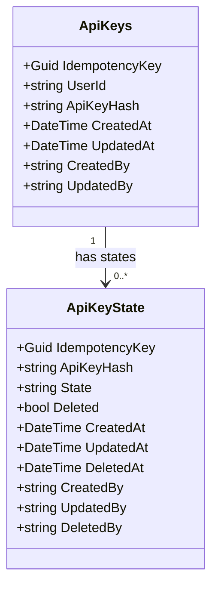

# Concept 001 — API Key Lifecycle

**Completed:** 2025-05-31  
**Related ADRs:** ADR-001

## How does the lifecycle of an API key look like?

I need to understand the lifecycle of an API key. What are the different states an API key can be in? What are the transitions between states?

## My initial answer (before implementing)

### What triggers a change?

A Change happens when a a caller request some action that requires to change the state of the system.
- Examples:
  - Creating a new API key
  - Activating an API key
  - Deactivating an API key
  - Revoking an API key
  - Updating an API key

### How does a change look? (Data Perspective)

- Creating a new API key -> a new Record should be created in the database
- Activating an API key -> the status of the API key should be set to active
- Deactivating an API key -> the status of the API key should be set to inactive
- Revoking an API key -> the status of the API key should be set to revoked
- Updating an API key -> the API key should be updated in the database

### How can the Data look like?

### What does the caller see?

The caller should see a response that indicates the success or failure of the operation.

## What the implementation revealed

[What did you discover while actually writing the code? Did anything surprise
you? Did your initial answer hold up?]

## The security principle this concept illustrates

[State it in one or two sentences, in plain language. Not a quote from a
textbook — your own words.]

## What I would do differently

[Is there anything in your implementation you're not fully satisfied with?
What would you improve if you revisited this?]
