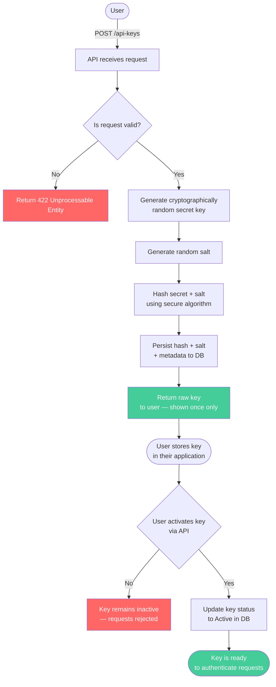
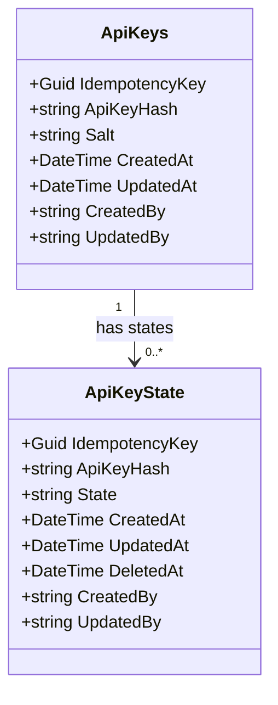

# Concept 002 — API Key Creation

**Completed:** 2025-05-31
**Related ADRs:** ADR-002 

## The questions I had to answer first

How can an API key be created securely in a way that the user can also retrieve it?

## My initial answer (before implementing)

I thought that an API key should be created via a secret key, salt and a secure hash algorithm.

### How a key is created

> **Note:** The raw secret key is returned exactly once at creation time and never stored. All subsequent validation compares a re-hash of the provided key against the stored hash.

## Data 

## What the implementation revealed

[What did you discover while actually writing the code? Did anything surprise
you? Did your initial answer hold up?]

## The security principle this concept illustrates

[State it in one or two sentences, in plain language. Not a quote from a
textbook — your own words.]

## What I would do differently

[Is there anything in your implementation you're not fully satisfied with?
What would you improve if you revisited this?]
