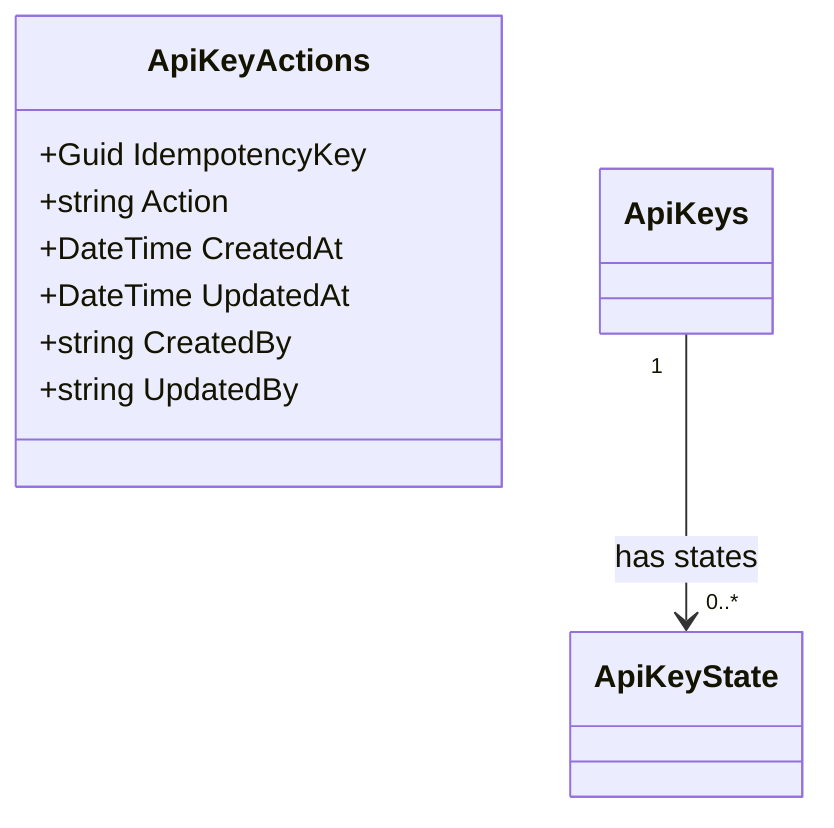

# Concept 003 — API Key Action Management

**Completed:** 2025-06-01
**Related ADRs:** ADR-003

## The questions I had to answer first

How will the allowed actions per api key be managed?

## My initial answer (before implementing)

We should store the allowed actions in a database table. 

Valid actions:
- read
- write
- delete
- execute

## What the implementation revealed

[What did you discover while actually writing the code? Did anything surprise
you? Did your initial answer hold up?]

## The security principle this concept illustrates

[State it in one or two sentences, in plain language. Not a quote from a
textbook — your own words.]

## What I would do differently

[Is there anything in your implementation you're not fully satisfied with?
What would you improve if you revisited this?]
