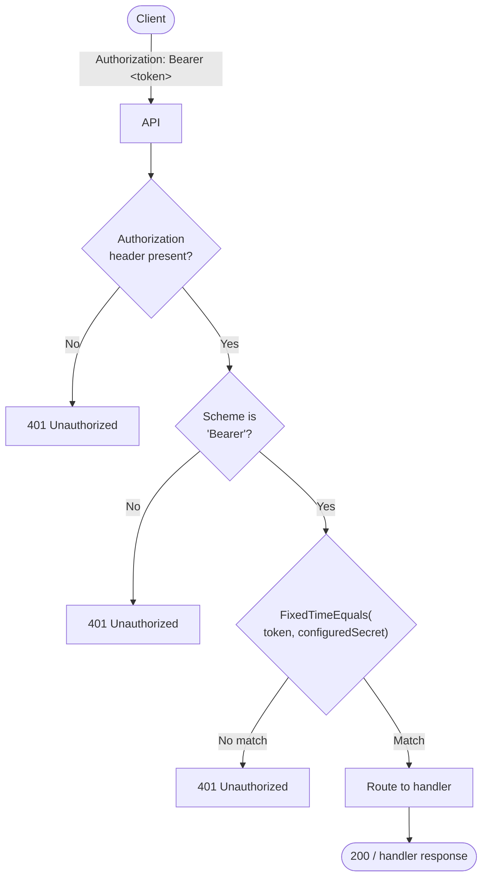

# Concept 004 — Authentication

**Completed:** 2026-06-03
**Related ADRs:** ADR-004

## The questions I had to answer first

I need to understand what authentication options are available and which one is most appropriate for this project.

## My initial answer (before implementing)

A static bearer token: a single pre-shared secret configured via environment variable. Every incoming request must carry it as `Authorization: Bearer <secret>`. The middleware extracts it, compares it with constant-time equality to resist timing attacks, and either passes the request through or returns 401 immediately.

## What the implementation revealed

My initial answer is had a slight misconception for the current usage of locksmith. The nature of a bearer token inside locksmith is used for authentication not for authorization. This meant that i had used the both words interchangeably when in reality those are completely different.

## The security principle this concept illustrates

Authentication is used to prove the identity of the requesting endpoint. Authorization is used to see if the current action is allowed for the current request.

## What I would do differently

I would look at the difference of specific keywords rather than just assuming that it is the correct thing.
