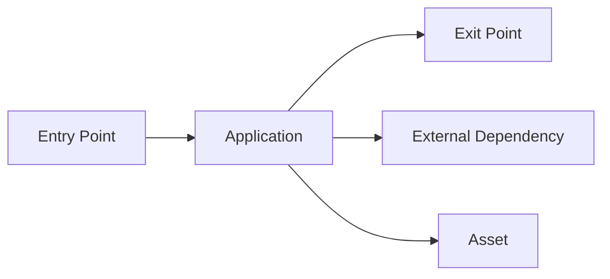

# Locksmith - Thread Model

**Application Version: v0.0.1-alpha**

**Description**: The container will be run in a Docker network and will be accessible via the opened port of the container to the host machine. The application handles the lifecycle of a 

**Document Owner**: Anthony Noel Weiß  
**Participants**: Anthony Noel Weiß  
**Reviewer**: Claude Anthropic 

## External Dependencies

The application will be run in a Docker container.

| ID    | Description |
| -------- | ------- | 
| 1 | Port of the Docker container |

## Entry Points

| ID    | Name | Description | Trust Levels |
| -------- | ------- | -------- | ------- |
| x | x | x | x |

## Exit Points

| ID    | Name | Description | Trust Levels |
| -------- | ------- | -------- | ------- |
| x | x | x | x |

## Assets

| ID    | Name | Description | Trust Levels |
| -------- | ------- | -------- | ------- |
| x | x | x | x |

## Trust Levels
| ID    | Name | Description |
| -------- | ------- | -------- | 
| x | x | x |

## Determine Threats

| Type    | Description | Security Control |
| -------- | ------- | -------- | 
| Spoofing | Threat action aimed at accessing and use of another user’s credentials, such as username and password. | x |
| Tampering | Threat action intending to maliciously change or modify persistent data, such as records in a database, and the alteration of data in transit between two computers over an open network, such as the Internet. | x |
| Repudiation | Threat action intending to maliciously change or modify persistent data, such as records in a database, and the alteration of data in transit between two computers over an open network, such as the Internet. | x |
| Information Disclosure | Threat action intending to read a file that one was not granted access to, or to read data in transit. | x |
| Denial of Service | Threat action attempting to deny access to valid users, such as by making a web server temporarily unavailable or unusable.| x |
| Elevation of Privilege | Threat action intending to gain privileged access to resources in order to gain unauthorized access to information or to compromise a system. | x |

### Thread Analysis

